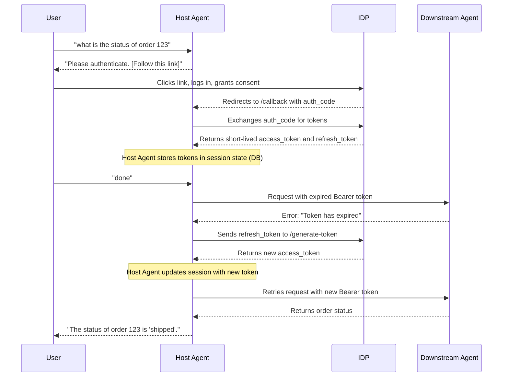

# Multi-Agent Airbnb Planner

This project is a functional proof-of-concept demonstrating a secure, multi-tenant, multi-agent architecture using the Agents for AI (A2A) specification and the Google Agent Development Kit (ADK). It features a central orchestrator (`host_agent`) that routes user requests to specialized downstream agents, handling OAuth 2.0 authentication and automatic token refresh.

## Architecture

The system is composed of a central orchestrator and several independent services and agents.


*   **`host_agent`**: The central orchestrator and single entry point for users. It uses an LLM to understand user prompts and route them to the appropriate downstream agent. It also manages the security flow, including the OAuth 2.0 token lifecycle, and persists session and task state to a local SQLite database.
*   **Downstream Agents**:
    *   `airbnb_agent`: Searches for accommodations.
    *   `calendar_agent`: Checks the user's Google Calendar.
    *   `weather_agent`: Provides weather forecasts.
    *   `horizon_agent`: A sample tenant-specific agent for retrieving order status. This agent is secure and requires an OAuth 2.0 token.
*   **`auth_lib`**: A shared library responsible for JWT validation, used by all secure downstream agents to protect their endpoints.
*   **`idp`**: A mock OAuth 2.0 Identity Provider that issues short-lived JWT access tokens and long-lived refresh tokens.
*   **`demo_agent_registry`**: A service discovery mechanism that provides the `host_agent` with the necessary endpoint information for all downstream agents.

## Getting Started

### Installation

It is highly recommended to use a Python virtual environment to manage dependencies.

1.  **Create a virtual environment:**
    ```bash
    python -m venv .venv
    ```

2.  **Activate the virtual environment:**
    *   On macOS and Linux:
        ```bash
        source .venv/bin/activate
        ```
    *   On Windows:
        ```bash
        .\.venv\Scripts\activate
        ```

3.  **Install the project and its dependencies:**
    From the project root directory, run the following command. The `-e` flag installs the project in "editable" mode, which is crucial for allowing the various agent modules to be discovered correctly.
    ```bash
    pip install -e .
    ```

## Security Architecture & Token Refresh Flow

The system's security is based on the OAuth 2.0 Authorization Code Grant flow, enhanced with an automatic refresh token mechanism to handle expired access tokens seamlessly.



### How it Works

1.  **Initial Authentication**: When a user needs to access a secure agent (like the `horizon_agent`), the `host_agent` initiates the OAuth 2.0 flow. The user is redirected to the mock Identity Provider (IDP) to log in.
2.  **Token Issuance**: Upon successful login, the IDP issues a very short-lived **access token** (valid for only 10 seconds in this demo) and a long-lived **refresh token**. The `host_agent` securely stores both in its session database.
3.  **Token Expiration**: When the `host_agent` attempts to use the access token after it has expired, the downstream agent rejects the request with a "token has expired" error.
4.  **Automatic Refresh**: The `host_agent` is designed to catch this specific error. It then uses the stored `refresh_token` to make a background request to the IDP's `/generate-token` endpoint.
5.  **Seamless Retry**: The IDP provides a new access token. The `host_agent` updates its session state and automatically retries the original request to the downstream agent, which now succeeds. This entire refresh process is transparent to the end-user.

## Running the System

### Step 1: Configure the Identity Provider (IDP)

In a terminal, navigate to the `idp` directory and generate the necessary keys. This only needs to be done once.

```bash
(cd idp && python generate_jwks.py)
```
This will create a `private_key.pem` file for signing tokens and a `jwks.json` file (the public key) within the `idp` directory.

### Step 2: Start the Services

To run the demo, you must start the mock IDP, the agent registry, and all agents in separate terminals. **Run each of these commands from the project root directory.**

**Terminal 1: Start the IDP**
```bash
python -m idp.app
```

**Terminal 2: Start the Agent Registry**
```bash
python -m demo_agent_registry.app
```

**Terminal 3: Start the Weather Agent**
```bash
python -m weather_agent
```

**Terminal 4: Start the Calendar Agent**
```bash
python -m calendar_agent
```

**Terminal 5: Start the Horizon Agent (for a specific tenant)**
```bash
python -m horizon_agent --port 10008 --tenant-id tenant-abc
```

**Terminal 6: Start the Airbnb Agent**
```bash
python -m airbnb_agent
```

**Terminal 7: Start the Host Agent**
```bash
# For tenant 'tenant-abc'
python -m host_agent --port 8083 --tenant-id tenant-abc
```

## Interacting with the System

1.  Open a browser and navigate to the `host_agent`'s Gradio UI at **http://localhost:8083**.
2.  To test the secure flow, enter a prompt for the Horizon agent, for example:
    `what is the status of order 123`
3.  You will be presented with a link to authenticate. Click the link.
4.  Log in to the mock IDP with username `john.doe` and password `password123`.
5.  Grant consent. You will be redirected back to the Gradio UI.
6.  After authenticating, signal the agent to continue by sending a message like "done" or re-submitting your original request. The agent will then use its stored credentials to complete the task. The token refresh flow will happen automatically in the background if the initial token expires.

## Key Development Learnings

1.  **A2A Task Delegation Lifecycle**: To correctly create a task on a remote agent, the client **MUST** send a `SendMessageRequest` *without* a `taskId`. The remote agent is responsible for creating the task and returning a `Task` object containing the new `remote_task_id`. The client must then capture this ID and associate it with its own local task record to maintain a link between the parent and child tasks.

2.  **Accessing Request Headers**: The A2A server framework does not expose request headers in the most intuitive location. They are not in `context.headers` or `context.call_context.headers`. Instead, they are located within the `ServerCallContext` object at `context.call_context.state['headers']`, and all header keys are lowercased (e.g., `authorization`).

3.  **Testing with Secrets**: To avoid committing private keys, a `test_config.py` file (which is git-ignored) is used to store secrets for the test suite. An example file (`test_config.example.py`) is provided as a template. This is a simple but effective pattern for managing secrets in a test environment.
